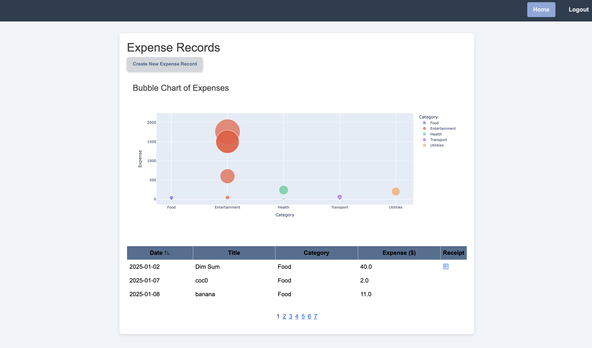

# Personal SpendWise App
Track your expenses effectively with Smart-Tracker




# Roadmap
1. Implement UI for Authentication and Authorization
2. Develop backend APIs for the session-based authentication service
3. Design and establish the database schema and connections
4. Implement basic & JWT-cookie authentication and authorization accessing to customer's dashboard.
5. Fix JWT token is shared if loginout and login with another users shortly
6. Implement Cache, pagination technique to reduce conjestion and optimize data retrieval from the database.
7. Build Expense Record Form to record expenses in the past(max: today, location is West US).
8. User can upload receipt(file), view in Expense table.
9. Build the Paginated Expense Record Table(create, view) with sorting function(with Boostrap).
10. Integrate with Plotly Dash and optimize asynchronous Chart Loading.
11. Integrate RabbitMQ to monitor user activity


# TODO feature 
1. Oauth third-party grant authorization, eg.Google Email
2. Enhance JWT implementation(Revoke multiple tokens for same users/limit concurrent logins)
3. Edit / delete expense entries
4. Customize category (add / edit / delete user's categories)
5. Add filter functionality: current month, previous month, all as default
6. OCR receipt parsing and make classification(X)
7. Send welcome email to new user
8. Create user profile: subscribe finance news
9. Use rabbitMQ to monitor email sent to users who subscribe finance news
10. Store data of user activity to DB


# Backend Setup
## Run the Application
To start the Flask application, use the following command:
```
flask run
```

## Update Database in development stage
#### To upgrade the existing database 
```
flask db init         # Initializes the migrations folder (if not already done)
flask db migrate -m "Initial migration"  # Creates a new migration script, check migrations/
flask db upgrade      # Applies the migration to the database
```

#### Change `id` type in `users`table
To change the ID type in the users table (from a truncated UUID string to an auto-increment integer), use the following steps:
1. Ensure PostgreSQL is installed on your system. in macos `brew install psql`.
2. Navigate to the backend/db_script directory.
3. Run the SQL script as follows:
```
psql -h <host: localhost> -U <username:postgres> -d <database:auth> -f update_users_table_id.sql
```


# RabbitMQ setup
In mac
```
brew services start rabbitmq
```
Run consumer
```
mq_consumer % python3 user_consumer.py
```
Check RabbitMQ GUI
```
http://localhost:15672
```